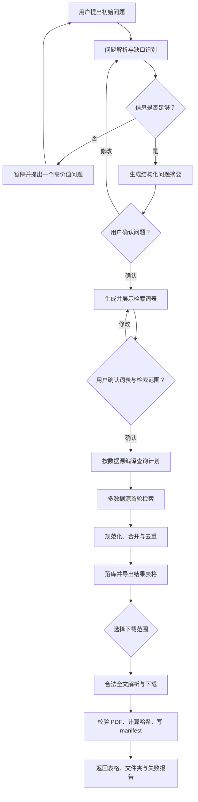

# 文献检索 Agent 架构与实施方案

> 版本：v1.0  
> 日期：2026-08-20  
> 目标：把一个模糊研究问题逐步澄清，生成可审计的检索词表，调用多个学术数据源完成首轮检索，将结果统一记录为表格，并在权限允许的前提下把全文下载到同一目录。

## 1. 结论先行

建议采用下面的总体方案：

- **编排框架：LangGraph**。原因是该任务有明确阶段、需要多次暂停等待用户回答、需要断点续跑，也需要保留每次检索和下载的状态。LangGraph 的 interrupt 与 checkpointer 正好对应这些要求；其 interrupt 会保存图状态，并能在用户补充信息后继续执行（[官方文档](https://langchain-ai.github.io/langgraph/concepts/breakpoints/)）。
- **架构形态：一个主 Agent + 多个确定性工具节点**，第一版不做自由对话式多 Agent。LLM 只负责澄清问题、扩展关键词和辅助相关性判断；检索、去重、表格写入、下载、限流和重试都由代码控制。
- **开发语言：Python 3.12**。学术 API、数据处理、PDF 校验、异步 HTTP 和 Agent 框架生态更完整。
- **MVP 技术栈：FastAPI + LangGraph + Pydantic + SQLAlchemy + SQLite/PostgreSQL + httpx + 本地文件系统**。
- **首轮数据源：OpenAlex + Crossref + Semantic Scholar**；医学方向追加 PubMed/Europe PMC，预印本追加 arXiv。
- **全文获取：只走开放获取或已授权通道**，优先 Unpaywall、Europe PMC/PMC、arXiv、CORE 和出版商明确提供的 OA/TDM 接口。禁止绕过付费墙、验证码或网站访问控制。
- **结果表格不是唯一数据源**。规范化结果先进入数据库，随后导出 `literature.csv` 和 `literature.xlsx`；这样既满足查看需求，也能避免 Excel 文件并发写入、损坏和难以追踪的问题。

一句话概括：**让 Agent 做判断，让工作流做控制，让数据库做记忆，让适配器负责不同网站。**

---

## 2. 需求拆解与系统边界

### 2.1 核心能力

1. 接收用户的初始问题，识别其中已经明确和仍然缺失的信息。
2. 通过 2～6 轮自适应提问，把问题整理成结构化的 `ResearchQuestionSpec`，最后让用户确认。
3. 按研究概念生成中英文关键词、同义词、缩写、学科主题词和排除词，形成可编辑、可追溯的词表。
4. 将词表编译成不同数据库各自支持的查询语法，而不是把同一个字符串直接发给所有网站。
5. 并行调用多个官方 API，保留原始响应和查询日志。
6. 规范化元数据，按 DOI、PMID、arXiv ID 和标题相似度去重，写入统一记录表。
7. 解析合法全文地址，按来源限流下载，校验 PDF，并把文件放入项目的统一 `papers/` 文件夹。
8. 任意步骤失败后可以重试或从断点继续，而不是整批重跑。

### 2.2 第一版不做的事情

- 不抓取需要登录、验证码或明确禁止自动访问的网页。
- 不绕过出版社付费墙，不使用来源不明的全文下载站点。
- 不把“引用量高”直接等同于“与问题相关”。
- 不让 LLM 自己维护唯一的文献列表；所有结果必须落库。
- 不在第一版自动完成系统综述的最终纳排、质量评价和证据综合。这些可以在检索稳定后作为第二阶段功能。
- 不把 Google Scholar 网页抓取作为基础能力；核心流程只依赖可维护的官方 API 或用户合法授权的接口。

---

## 3. 框架选型

### 3.1 候选框架比较

| 方案 | 优点 | 局限 | 本项目结论 |
|---|---|---|---|
| **LangGraph** | 状态图清晰；支持人工中断、持久化、恢复；容易把 LLM 节点和确定性代码节点混合 | 需要自己设计状态和边；初始代码量略多 | **首选**，最符合“反复澄清 + 确认点 + 长任务”的结构 |
| **OpenAI Agents SDK** | 代码简洁；具备工具、编排、结果状态、人工审核和可观测性入口；官方文档明确支持 Python/TypeScript 代码优先的 Agent 应用（[OpenAI Docs](https://developers.openai.com/api/docs/guides/agents)） | 若要实现本项目的细粒度工作流、跨数据源断点和定制状态，仍需自行补充较多业务层 | 如果团队已经全量使用 OpenAI 技术栈，可作为备选 |
| **AutoGen AgentChat** | 多 Agent 会话和人工参与能力较完整 | 当前任务实际是固定流水线，多 Agent 会增加调用成本、上下文噪声和不确定性；其官方文档也建议先从单 Agent 开始（[官方文档](https://microsoft.github.io/autogen/stable/user-guide/agentchat-user-guide/tutorial/teams.html)） | 第一版不采用 |
| 自己写状态机 | 完全可控、依赖少 | 人工中断、恢复、分支、追踪等基础能力都要重复开发 | 只有在依赖限制非常严格时采用 |

### 3.2 推荐的框架组合

#### MVP（单机或少量用户）

| 层 | 推荐组件 | 用途 |
|---|---|---|
| Agent/工作流 | LangGraph | 状态流转、人工确认点、重试和断点恢复 |
| API 服务 | FastAPI | 对话、检索、下载、导出接口；SSE 推送进度 |
| 数据模型 | Pydantic v2 | 约束 LLM 结构化输出和 API 输入输出 |
| ORM/迁移 | SQLAlchemy 2 + Alembic | 业务表、版本迁移 |
| 数据库 | SQLite（个人原型）/ PostgreSQL（正式版） | 项目、问题、词表、查询、记录和下载状态 |
| HTTP | httpx | 异步调用学术 API 和下载文件 |
| 重试/限流 | tenacity + aiolimiter | 指数退避、按来源限速 |
| 表格导出 | pandas + openpyxl | 输出 CSV/XLSX |
| 文件存储 | 本地目录 | MVP 的 PDF、原始 JSON、查询和日志 |
| 前端 | Streamlit | 最快完成可用原型 |

#### 正式部署

- PostgreSQL 取代 SQLite，并使用 LangGraph 的生产级数据库 checkpointer。
- Redis + Celery/RQ 承担耗时检索和下载任务；API 进程只受理请求和返回进度。
- S3/MinIO 取代本地文件系统，同时仍可提供“导出为一个文件夹”的能力。
- React/Vue 前端取代 Streamlit。
- OpenTelemetry + 结构化日志记录每个节点、API 延迟、重试和失败原因。

### 3.3 为什么第一版不要拆成多个自由 Agent

“澄清 Agent、关键词 Agent、检索 Agent、下载 Agent”在概念上容易理解，但不必对应四个会自由聊天的 LLM。更稳妥的实现是一个 LangGraph，其中只有少数节点调用模型，其余都是普通函数：

- 可以准确控制什么时候询问用户、什么时候必须确认。
- 可以确保同一条查询不会被模型重复调用。
- 可以在每个节点后落库，进程退出后也不会丢失进度。
- 可以对每个 API 单独限流、重试和记录成本。
- 后续如果某个模块真的复杂，再把该节点升级为专门 Agent，而不用改动整个数据管线。

---

## 4. 总体架构



### 4.1 LangGraph 状态建议

```python
class ResearchState(TypedDict):
    project_id: str
    messages: list[dict]
    question_spec: dict | None
    missing_fields: list[str]
    question_confirmed: bool
    term_table: list[dict]
    terms_confirmed: bool
    query_plans: list[dict]
    active_run_id: str | None
    retrieval_stats: dict
    download_policy: dict | None
    errors: list[dict]
    next_action: str
```

注意：状态中只放 ID、摘要和控制信息。成百上千条文献记录、原始响应和 PDF 不应塞进 LLM 上下文或图状态，而应放在数据库/文件存储中。

---

## 5. 具体实现流程

### 5.1 阶段 A：通过多轮提问澄清研究问题

#### 处理方式

1. LLM 从初始问题中抽取已知槽位。
2. 根据问题类型选择结构模板：
   - 临床干预：PICO/PICOS；
   - 暴露或风险因素：PECO；
   - 质性研究：SPIDER；
   - 通用技术/社会科学问题：Concept–Context–Outcome。
3. 计算缺失项，并一次只问一个最能改变检索范围的问题；必要时同一轮最多问两个紧密相关的问题。
4. 用户回答后合并状态，不重复询问已回答内容。
5. 达到停止条件后，生成一段明确问题摘要和纳排边界，请用户显式确认。

#### 建议的结构化问题对象

```yaml
original_question: 用户原始问题
research_objective: 想解释、比较、评估还是综述什么
population_or_object: 人群、对象或技术
intervention_or_exposure: 干预、暴露或核心概念
comparator: 对照，可为空
outcomes: 关注的结果
context: 场景、地区、行业或学科
study_types: 研究设计或文献类型
date_from: 起始年份
date_to: 结束年份
languages: [en, zh]
must_include: []
exclude: []
databases: []
fulltext_requirement: abstract_or_fulltext
confirmed: false
```

#### 澄清问题的优先级

1. 研究对象/人群；
2. 核心干预、技术或暴露；
3. 目标结果；
4. 文献类型和研究设计；
5. 时间、语言和地域边界；
6. 用户是否只接受开放全文。

#### 停止规则

- 核心概念已经能形成至少两个有效检索概念块；
- 时间、语言和文献类型已经明确，或用户主动选择“不限”；
- 用户确认系统生成的最终问题摘要；
- 最多 6 轮仍不完整时，不死循环：展示当前假设和未决项，由用户决定继续还是按默认值检索。

---

### 5.2 阶段 B：生成可审计的检索词表

词表不能只是一串由模型随意生成的单词。每个词都应记录它属于哪个概念、来自哪里、是否启用以及适用的数据源。

#### 词表字段

| 字段 | 含义 | 示例 |
|---|---|---|
| `concept_id` | 概念块 | C1 |
| `concept_name` | 概念名称 | 大语言模型 |
| `term` | 原始检索词 | large language model |
| `normalized_term` | 规范化值 | large language model |
| `language` | 语言 | en |
| `term_type` | 首选词/同义词/缩写/主题词/排除词 | synonym |
| `source` | LLM、MeSH、用户、种子论文关键词等 | MeSH |
| `field_hint` | title/abstract/keyword/all | title_abstract |
| `enabled` | 是否进入查询 | true |
| `notes` | 歧义或使用说明 | LLM 也可能指课程名称 |

#### 词的来源优先级

1. 用户明确提供的领域术语；
2. 规范主题词，如医学中的 MeSH；
3. 种子论文的标题、摘要和作者关键词；
4. 常见全称、缩写、拼写变体和英美拼写；
5. LLM 生成的候选同义词；
6. 中文问题的英文专业翻译和反向校验。

LLM 生成词必须标记 `source=llm`，不能伪装成受控词表术语。对于 Emtree 等需要授权的词表，只能在用户有合法订阅时接入。

#### 组合策略

不要把所有词做笛卡尔积。例如三个概念块分别有 20、15、10 个词，逐条组合会产生 3,000 条查询，既浪费额度，也难以审计。推荐：

- 同一概念内用 `OR`；
- 不同概念之间用 `AND`；
- 生成 3～10 个有明确目的的查询变体，而不是几千个单词组合；
- 第一轮优先高召回，排除词谨慎使用；
- 对不同数据库用 query compiler 转换字段标签、通配符、短语和日期语法。

示例概念块：

```text
C1 = ("large language model" OR LLM OR "generative AI")
C2 = ("literature search" OR "information retrieval" OR "systematic review")
C3 = (agent OR assistant OR automation)

Broad query = C1 AND C2
Focused query = C1 AND C2 AND C3
```

建议的查询层级：

- `broad`：核心两个概念块，高召回；
- `focused`：加入上下文或结果概念，提高精度；
- `controlled_vocab`：使用 MeSH 等数据库专有主题词；
- `exact_phrase`：针对核心固定短语；
- `citation_expansion`：首轮拿到种子论文之后，再查其参考文献、被引文献和相关推荐，属于第二轮扩展。

---

### 5.3 阶段 C：将词表编译成不同网站的查询

定义统一接口，而不是在业务代码中堆放每个网站的条件分支：

```python
class SearchProvider(Protocol):
    name: str

    async def compile_query(self, spec, term_table) -> list[ProviderQuery]: ...
    async def search(self, query, cursor=None) -> SearchPage: ...
    def normalize(self, raw_item) -> NormalizedWork: ...
```

每个 `ProviderQuery` 至少保存：

```yaml
query_id: uuid
provider: openalex
purpose: broad
canonical_query: C1 AND C2
provider_query: '("large language model" OR LLM) AND "literature search"'
filters:
  from_year: 2020
  to_year: 2026
  type: article
page_size: 100
max_records: 500
```

#### 首选数据源

| 数据源 | 主要作用 | 全文能力 | 接入建议 |
|---|---|---|---|
| [OpenAlex](https://developers.openalex.org/api-reference/works/list-works) | 跨学科检索、引用信息、OA 状态、机构/主题信息 | 部分记录有内容/OA 位置，下载需按接口额度和授权 | **首轮主源**。支持布尔、短语、模糊和语义搜索；当前 API 使用 key，并应按返回的额度头限流（[认证与额度](https://developers.openalex.org/api-reference/authentication)） |
| [Crossref REST API](https://www.crossref.org/documentation/retrieve-metadata/rest-api/) | DOI 和出版元数据补全、类型/日期/license 过滤 | 不是通用全文库 | **元数据权威补全源**。使用 `mailto` 和明确 User-Agent，缓存响应并退避（[访问规范](https://www.crossref.org/documentation/retrieve-metadata/rest-api/access-and-authentication/)） |
| [Semantic Scholar](https://www.semanticscholar.org/product/api) | 学术图谱、引用、参考文献、相关推荐、部分 PDF URL | 部分 OA PDF URL | **发现和扩展源**。申请 API key；批量端点优先，并按 429 退避（[教程](https://www.semanticscholar.org/product/api/tutorial)） |
| [PubMed E-utilities](https://www.ncbi.nlm.nih.gov/books/NBK25497/) | 医学/生命科学检索、MeSH、PMID | PubMed 本身主要提供索引；全文转 PMC/Europe PMC | 医学问题默认开启；遵守 NCBI 标识和请求频率规范 |
| [Europe PMC](https://europepmc.org/RestfulWebService) | 生命科学检索、引用、OA 全文 XML 和全文链接 | OA 子集可获取全文 | 医学方向优先于自行抓出版社网页 |
| [arXiv API](https://info.arxiv.org/help/api/user-manual.html) | 计算机、数学、物理等预印本 | arXiv 论文通常有直接 PDF | 相关学科开启，保留 arXiv ID 和版本号 |
| [Unpaywall API](https://unpaywall.org/api) | 按 DOI 判断 OA 并返回最佳开放版本 | 提供 `best_oa_location`/PDF 地址 | **全文解析主通道**。请求必须带 email；记录 OA 版本和 license（[字段说明](https://unpaywall.org/data-format)） |
| [CORE API](https://core.ac.uk/services/api) | 聚合机构仓储和 OA 全文，尤其可补无 DOI 记录 | 提供大量 OA 全文 | 作为可选增强源；需检查当前使用条款、注册与频率限制 |

#### 关于 PMC 的近期变更

当前日期接近 PMC 基础设施切换时间。PMC 官方说明旧的 OA Web Service/FTP 等遗留通道将在 **2026-08-24** 起不再可用，并提供新的 AWS S3 数据结构（[官方说明](https://pmc.ncbi.nlm.nih.gov/tools/pmcaws/)）。因此新系统不要依赖即将下线的旧 OA Web Service；从一开始就使用 Europe PMC REST、NCBI 当前接口或 PMC 新 S3 方案，并依据 `oa_comm`、`oa_noncomm` 等许可分区控制用途。

#### 中国知网、万方、维普等中文来源

第一版建议采用“用户从有权访问的平台导出 RIS/BibTeX/EndNote/CSV，再导入本系统”的方式。只有在获得正式 API、机构授权和明确自动化许可后，才添加对应适配器。不要用浏览器自动化绕过登录、验证码、下载限制或机构权限。

---

### 5.4 阶段 D：首轮检索、规范化与去重

#### 检索执行步骤

1. 为每个 provider 生成查询计划和预计最大结果数。
2. 用户确认数据源、日期、语言和检索规模。
3. 按数据源并发执行；同一数据源内部受独立限流器控制。
4. 每拿到一页就保存原始响应、游标和时间戳，避免进程崩溃后从第一页重跑。
5. 将原始记录映射到统一 `NormalizedWork`。
6. 进行去重和来源合并。
7. 计算透明的相关性辅助分数，但不直接删除低分记录。
8. 写入数据库并导出表格。

#### 去重顺序

1. 规范化 DOI 完全匹配；
2. PMID、PMCID、arXiv ID、Semantic Scholar ID、OpenAlex ID 等标识符匹配；
3. 标题规范化后完全匹配，并要求年份接近；
4. 标题相似度 + 第一作者 + 年份的组合匹配；
5. 仍然不确定的记录标记 `possible_duplicate`，交给用户确认，不能静默删除。

标题规范化应处理大小写、Unicode、标点、HTML 标签、连字符和空白，但保留原始标题用于展示。

#### 结果表格字段

| 字段组 | 建议字段 |
|---|---|
| 主键 | `record_id`, `canonical_work_id` |
| 题录 | `title`, `authors`, `year`, `publication_date`, `venue`, `volume`, `issue`, `pages`, `work_type`, `language` |
| 摘要与主题 | `abstract`, `author_keywords`, `subjects` |
| 标识符 | `doi`, `pmid`, `pmcid`, `arxiv_id`, `openalex_id`, `s2_id` |
| 检索溯源 | `sources`, `matched_query_ids`, `first_retrieved_at`, `last_updated_at`, `raw_record_paths` |
| 质量提示 | `citation_count`, `is_retracted`, `retraction_source`, `relevance_score`, `relevance_reason` |
| 获取状态 | `is_oa`, `oa_status`, `license`, `landing_url`, `pdf_url`, `download_status`, `local_path`, `sha256`, `download_error` |
| 人工筛选 | `user_decision`, `exclude_reason`, `notes`, `tags` |

其中 `citation_count` 必须同时记录来源和抓取时间，因为不同数据库的统计口径会变化。

#### 建议的相关性评分

评分只用于排序，不用于自动删除：

```text
score = 0.40 * 题目/摘要词项匹配
      + 0.35 * 语义相似度
      + 0.15 * 研究设计/年份/语言条件匹配
      + 0.10 * 可信元数据完整度
```

不要把引用次数直接放入主题相关性主分数，否则会系统性压低新论文和小众领域论文。引用量可以作为单独排序字段。

---

### 5.5 阶段 E：合法全文解析与统一下载

#### 下载解析链

对每一条记录按顺序尝试：

1. 本地是否已经存在相同 `record_id` 或 SHA-256；
2. 元数据中是否有明确的开放 PDF URL；
3. 有 DOI 时调用 Unpaywall，读取 `best_oa_location`；
4. 有 PMCID 时走 Europe PMC/PMC 当前允许的 OA 通道；
5. 有 arXiv ID 时走 arXiv PDF；
6. 调用 CORE 查找机构仓储开放版本；
7. 调用出版商官方 OA/TDM API，但仅在用户提供合法凭据且接口条款允许时；
8. 都失败则标记 `manual_access_required`，在表格中保留落地页，不继续绕过访问控制。

#### 下载前的用户策略

结果可能从几十篇到几千篇，建议提供三种模式：

- `selected`：只下载用户勾选的记录，默认；
- `top_n_oa`：下载相关性排序前 N 篇开放全文；
- `all_oa`：下载全部确认可合法获取的开放全文。

在执行 `all_oa` 前展示预计文件数、来源和磁盘占用，并要求用户确认。

#### 文件校验

- HTTP 状态为 200；
- 限制重定向次数，并记录最终 URL；
- 检查 Content-Type，同时检查文件头是否为 `%PDF-`，防止把登录页保存成 PDF；
- 设置单文件最大大小、连接超时和总超时；
- 先写入 `.part` 临时文件，完成校验后原子重命名；
- 计算 SHA-256，避免重复保存同一文件；
- 保存 `license`、下载来源、下载时间和版本类型（published/accepted/preprint）；
- 失败使用指数退避，4xx 权限错误不无限重试，429/5xx 按 `Retry-After` 处理。

#### 文件命名

```text
{year}_{first_author}_{short_title}_{stable_id}.pdf
```

例如：

```text
2025_Wang_LLM_for_literature_search_10.1234_abcd.pdf
```

对文件名进行跨平台清洗；真正身份以数据库主键和 SHA-256 为准，不依赖文件名。

---

## 6. 项目目录设计

### 6.1 每个检索项目的输出目录

```text
workspace/
└── projects/
    └── {project_slug}_{project_id}/
        ├── project.yaml
        ├── question/
        │   ├── research_question.json
        │   └── clarification_log.jsonl
        ├── queries/
        │   ├── terms.csv
        │   ├── query_plan.json
        │   └── executed_queries.jsonl
        ├── raw/
        │   ├── openalex/
        │   ├── crossref/
        │   ├── semantic_scholar/
        │   └── pubmed/
        ├── records/
        │   ├── literature.csv
        │   ├── literature.xlsx
        │   ├── literature.jsonl
        │   └── possible_duplicates.csv
        ├── papers/
        │   └── *.pdf
        ├── manifest/
        │   ├── downloads.jsonl
        │   └── failed_downloads.csv
        └── logs/
            └── workflow.jsonl
```

所有成功下载的文献都位于同一个 `papers/` 文件夹，满足“放到同一文件夹”的要求；其他目录只保存元数据、审计记录和失败信息。

### 6.2 代码目录

```text
app/
├── api/                  # FastAPI routes、SSE
├── graph/                # LangGraph 状态、节点和边
│   ├── state.py
│   ├── workflow.py
│   └── nodes/
├── schemas/              # Pydantic 模型
├── providers/            # 检索适配器
│   ├── base.py
│   ├── openalex.py
│   ├── crossref.py
│   ├── semantic_scholar.py
│   ├── pubmed.py
│   ├── europe_pmc.py
│   └── arxiv.py
├── resolvers/            # 全文地址解析器
│   ├── unpaywall.py
│   ├── europe_pmc.py
│   ├── arxiv.py
│   └── core.py
├── services/
│   ├── term_builder.py
│   ├── query_compiler.py
│   ├── normalizer.py
│   ├── deduplicator.py
│   ├── downloader.py
│   └── exporter.py
├── repositories/         # 数据访问层
├── workers/              # 后台任务
├── config.py
└── main.py

tests/
├── unit/
├── integration/
├── fixtures/
└── evals/
```

---

## 7. 数据库设计

最少需要以下业务表：

| 表 | 用途 |
|---|---|
| `projects` | 一个研究问题对应一个项目 |
| `messages` | 澄清对话历史 |
| `question_specs` | 结构化问题的版本和确认状态 |
| `terms` | 检索词表及来源 |
| `query_plans` | 编译后的各数据源查询 |
| `retrieval_runs` | 每次检索运行的状态、开始/结束时间和统计 |
| `raw_records` | 数据源原始记录位置、响应哈希 |
| `works` | 去重后的规范化文献 |
| `work_identifiers` | DOI、PMID、arXiv ID 等一对多标识符 |
| `work_sources` | 文献由哪些来源和查询命中 |
| `download_attempts` | 每次下载解析和请求的结果 |
| `files` | 本地/对象存储路径、SHA-256、大小、MIME 和 license |
| `workflow_checkpoints` | LangGraph 状态检查点，具体表由 checkpointer 管理 |

关键约束：

- `doi_normalized` 有条件唯一；
- `(identifier_type, identifier_value)` 唯一；
- 同一 `project_id + provider + provider_query_hash` 可重复运行但必须产生新的 `run_id`，便于比较检索更新；
- 文件以 SHA-256 去重；
- 原始记录不覆盖，规范化记录可以版本化更新。

---

## 8. API 与界面设计

### 8.1 后端接口

| 方法 | 路径 | 作用 |
|---|---|---|
| `POST` | `/projects` | 创建检索项目并提交初始问题 |
| `POST` | `/projects/{id}/messages` | 回答澄清问题或修改条件 |
| `GET` | `/projects/{id}/state` | 获取当前阶段、缺失项和统计 |
| `POST` | `/projects/{id}/confirm-question` | 确认结构化问题 |
| `GET/PUT` | `/projects/{id}/terms` | 查看和编辑词表 |
| `POST` | `/projects/{id}/confirm-terms` | 确认词表和范围 |
| `POST` | `/projects/{id}/search-runs` | 启动检索 |
| `GET` | `/projects/{id}/works` | 分页查看、筛选文献 |
| `POST` | `/projects/{id}/downloads` | 按 selected/top_n_oa/all_oa 下载 |
| `GET` | `/projects/{id}/events` | SSE 查看检索/下载进度 |
| `GET` | `/projects/{id}/exports/{format}` | 导出 CSV、XLSX、RIS、BibTeX |

### 8.2 MVP 页面

1. **问题页**：聊天区 + 右侧实时结构化问题卡片；
2. **词表页**：按概念块分组，可开关、编辑、添加术语；
3. **查询预览页**：显示各网站实际执行的查询和上限；
4. **结果页**：表格、来源、相关性、OA 状态、人工纳排；
5. **下载页**：进度、成功/失败数量、打开 `papers/` 文件夹和失败原因；
6. **审计页**：每次运行的查询、时间、返回数、错误和版本。

---

## 9. 可靠性、安全与合规

### 9.1 API 可靠性

- 每个 provider 单独配置 QPS、并发数、超时和日额度；不要设置一个全局固定值。
- 优先使用 batch/bulk 接口，遵循官方分页方式。
- 对 GET 元数据请求做缓存，缓存键包含 provider、query 和参数。
- 处理 429 的 `Retry-After`，对 5xx 指数退避并加入随机抖动。
- 保存 cursor/checkpoint；每页写入后再推进游标。
- API 返回 schema 变化时保留原始 JSON，并让适配器明确失败，不能悄悄丢字段。

### 9.2 密钥与隐私

- API key 只放环境变量或 Secret Manager，不写入项目文件、日志或表格。
- 对发送给 LLM 的用户内容做最小化；如果问题涉及未公开研究，不把无关附件或个人信息发送给外部模型。
- 追踪系统默认屏蔽 API key、邮箱、全文内容和可能敏感的研究数据。
- 下载 URL 可能包含临时 token，日志只存脱敏后的 URL 或加密字段。

### 9.3 版权和使用条款

- “网页可以打开”不等于“允许自动批量下载”；必须以 API 条款、license 和机构授权为准。
- OA 代表可免费访问，但不一定允许任意再分发或商业使用；保存每份文件的具体 license。
- 不绕过登录、验证码、robots/访问控制、付费墙或速率限制。
- 对无法自动获取的文章只保留 DOI、落地页和 `manual_access_required` 状态。
- 如果用于商业产品，重新审查 CORE、PMC 非商业分区和各出版商 TDM 条款。

---

## 10. 测试与评估

### 10.1 单元测试

- 问题槽位合并：新回答不应覆盖已经确认的信息；
- 词表规范化：大小写、Unicode、缩写和排除词；
- 每个 provider 的 query compiler；
- 各来源原始 JSON 到 `NormalizedWork` 的映射；
- DOI/PMID/标题模糊去重；
- 安全文件名、PDF 文件头、SHA-256 和幂等下载；
- 429、超时、无效 JSON、HTML 伪装 PDF 等错误路径。

### 10.2 集成测试

- 使用录制/固定的 API 响应 fixture，避免测试套件频繁打真实接口；
- 每个 provider 保留少量 live smoke test，按计划运行而不是每次提交都运行；
- 模拟检索到第 3 页进程中断，验证重启后从正确游标继续；
- 模拟同一论文来自三个网站，验证只生成一条规范记录，但保留三个来源；
- 模拟 Unpaywall 无结果、Europe PMC 成功的下载降级链。

### 10.3 Agent 评估集

准备 20～50 个覆盖不同学科和模糊程度的金标问题，每个问题记录：

- 必须追问的信息；
- 可接受的结构化问题；
- 必须出现和不应出现的关键词；
- 一组已知相关种子论文；
- 预期启用的数据源；
- 是否存在可合法下载的全文。

建议指标：

- 澄清完整率；
- 无意义/重复提问率；
- 关键词覆盖率和错误扩展率；
- 已知种子论文召回率；
- 前 20/50 条精度；
- DOI 去重准确率；
- 合法全文解析成功率；
- PDF 有效率；
- 断点恢复成功率；
- 每个项目的 LLM 调用次数、API 请求数、耗时和错误率。

---

## 11. 分阶段实施计划

以下工期按一名熟悉 Python 的开发者估算；如果此前没有 Agent 或异步 API 开发经验，可增加 30%～50%。

### Phase 0：需求和样例（1～2 天）

- 选 5 个真实研究问题作为验收样例；
- 明确主要学科、是否必须包含中文文献、单次预计文献量；
- 确定只下载 OA，还是还需要机构授权 TDM 接口；
- 建立数据源配置和合规清单。

**交付物**：需求基线、5 个金标问题、环境变量清单。

### Phase 1：澄清与词表（3～5 天）

- 建立 FastAPI、数据库、LangGraph 和 checkpointer；
- 实现 `ResearchQuestionSpec` 抽取、缺口识别、interrupt 和用户确认；
- 实现词表结构、编辑和查询预览；
- 完成最小 Streamlit UI。

**交付物**：能完成多轮澄清并导出 `terms.csv` 的原型。

### Phase 2：首轮检索与表格（5～8 天）

- 实现 OpenAlex、Crossref、Semantic Scholar 三个 provider；
- 实现分页、限流、重试、原始响应留存；
- 实现规范化、标识符去重和标题模糊去重；
- 导出 CSV/XLSX/RIS/BibTeX。

**交付物**：从确认词表到生成统一 `literature.xlsx` 的完整链路。

### Phase 3：全文下载（3～5 天）

- 实现 Unpaywall、Europe PMC/PMC 当前通道、arXiv 和 CORE resolver；
- 实现下载模式、PDF 校验、原子写入、哈希去重和 manifest；
- 展示失败原因和人工获取链接。

**交付物**：统一 `papers/` 文件夹和可审计下载报告。

### Phase 4：领域扩展和质量加固（5～8 天）

- 医学方向加入 PubMed/MeSH；其他学科按需求增加适配器；
- 加入语义排序和种子论文引用扩展；
- 完成中断恢复、负载、合规和回归测试；
- 加入可观测性和成本统计。

**交付物**：可稳定重复运行的 Beta 版。

总体上，**3～5 周可以完成一个可用的单用户 Beta**。正式多用户部署、机构登录和商业数据库授权通常另算。

---

## 12. MVP 验收标准

系统满足以下条件即可认为第一版完成：

1. 对一个模糊问题能进行多轮追问，并输出可编辑、可确认的结构化问题；
2. 能生成按概念分组的词表，记录词的类型、来源和启用状态；
3. 能为至少 OpenAlex、Crossref、Semantic Scholar 编译并执行不同查询；
4. 首轮结果能规范化、去重并导出 CSV/XLSX，且每条记录能追溯到来源和查询；
5. 能从至少 Unpaywall、Europe PMC/PMC、arXiv 三类合法通道解析并下载可获得全文；
6. 所有 PDF 位于同一项目 `papers/` 文件夹，并在 manifest 中有 URL、license、哈希和状态；
7. 付费或无权限文献被标记为人工获取，不发生绕过；
8. API 超时、429 或程序重启后可以继续，已完成结果不会重复写入或重复下载；
9. 对 5 个金标问题，已知种子论文可以在设定的结果上限内被召回；
10. 用户可以看到系统实际问过什么、用了什么词、向哪个数据库发了什么查询、下载了什么文件。

---

## 13. 建议的第一批开发任务

按依赖顺序创建任务：

1. 初始化 Python 项目、配置、日志、数据库和迁移；
2. 定义 `ResearchQuestionSpec`、`Term`、`ProviderQuery`、`NormalizedWork`、`DownloadAttempt`；
3. 建立 LangGraph 状态和 `clarify -> confirm_question -> build_terms -> confirm_terms` 流程；
4. 完成 OpenAlex provider 和端到端落库；
5. 添加 Crossref、Semantic Scholar，完成来源合并和去重；
6. 添加 CSV/XLSX/RIS/BibTeX 导出；
7. 完成 Unpaywall resolver 和安全下载器；
8. 添加 Europe PMC、arXiv、CORE resolver；
9. 完成 Streamlit 的五个核心页面；
10. 建立金标问题和自动评估；
11. 最后再加入语义排序、引用扩展和更多数据库。

最适合的第一条纵向切片不是“先把所有 Agent 写完”，而是：

```text
一个模糊问题
→ 一轮澄清
→ 用户确认
→ 生成词表
→ OpenAlex 检索
→ 结果落库和 CSV
→ Unpaywall 下载一篇 OA PDF
```

先让这条最小链路端到端可运行，再逐个增加数据源和复杂能力，可以最快暴露状态、去重、下载和合规方面的真实问题。

---

## 14. 最终推荐

如果这是个人作品集或求职项目，最有说服力的实现不是堆叠很多 Agent 名称，而是展示以下工程能力：

- 人在回路的多轮澄清；
- 结构化输出和显式状态；
- 多数据源适配器模式；
- 可复现的查询与结果溯源；
- DOI/标题多级去重；
- 合法全文解析与稳健下载；
- 限流、重试、断点和幂等；
- 一套能测量召回率与错误率的评估集。

因此建议最终采用：

> **LangGraph + FastAPI + Pydantic + PostgreSQL（原型可先 SQLite）+ httpx + Streamlit + 本地/S3 文件存储**，以单主 Agent 和确定性工具节点构建；首批接入 OpenAlex、Crossref、Semantic Scholar、Unpaywall，并根据学科添加 PubMed/Europe PMC 或 arXiv。

这套结构既能快速做出 MVP，也为后续加入筛选、摘要、质量评价、引用网络、Zotero 同步和系统综述报告生成保留了清晰扩展点。
